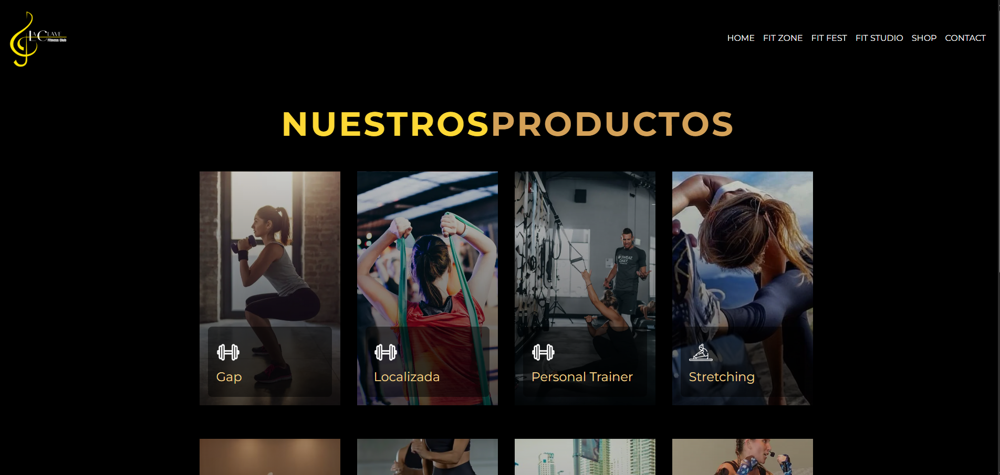
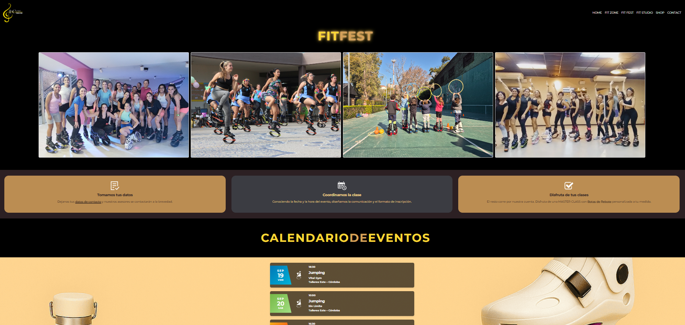
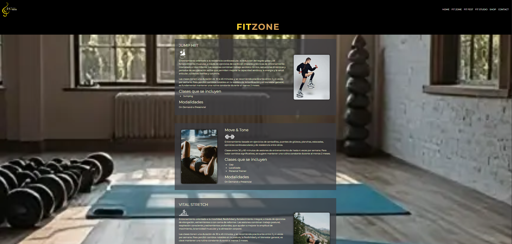
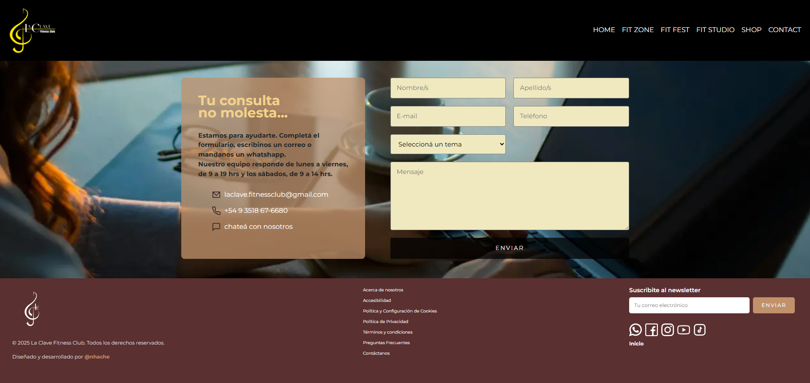

🏋️‍♂️ La Clave Fitness Club  
Bienvenido al repositorio oficial del sitio web de La Clave Fitness Club, una plataforma estática diseñada para promover un estilo de vida saludable, ofreciendo información sobre cursos, productos y contacto con el club. Este proyecto está desarrollado con HTML5, CSS3, JavaScript, Bootstrap y SweetAlert, e integrado con Firebase para hosting, almacenamiento de imágenes y gestión de datos.

🎯 Descripción 
La Clave Fitness Club es un sitio web estático que permite a los usuarios explorar los servicios del club, incluyendo cursos de fitness, una tienda de productos y un formulario de contacto. Utiliza Firebase Firestore para gestionar datos de productos y cursos en tiempo real, Firebase Storage para almacenar imágenes, y Firebase Hosting para el despliegue. Los estilos están optimizados con Bootstrap 5.3.6 para una navegación responsive (usando su componente navbar) y SweetAlert para notificaciones personalizadas.

🚀 Tecnologías Utilizadas

* Frontend: HTML5, CSS3, JavaScript
* Framework: Bootstrap 5.3.6 (via CDN, para navbar y estilos responsive)
* Notificaciones: SweetAlert (via CDN, para alertas personalizadas)
* Hosting: Firebase Hosting
* Almacenamiento: Firebase Storage (para imágenes)
* Base de datos: Firebase Firestore (para productos y cursos)

📂 Estructura del Proyecto 
textlaclave-fitnessclub/ 
├── index.html              # Página principal 
├── css/                    # Estilos CSS personalizados 
├── js/                     # Scripts JavaScript (incluye SweetAlert) 
├── img/                    # Imágenes locales 
├── pages/                  # Páginas secundarias 
│   ├── contacto.html       # Página de contacto 
│   ├── tienda.html         # Página de la tienda 
│   ├── legales.html        # Página de información legal 
│   ├── 404.html            # Página de error 404 
└── .env                    # Variables de entorno (no incluidas en el repositorio) 

🔧 Instalación y Configuración 
El sitio es estático y puede visualizarse abriendo index.html directamente en un navegador. Sin embargo, para integrar con Firebase (hosting, storage o Firestore) o instalar dependencias, sigue estos pasos:

Prerrequisitos

* Un navegador web moderno (para visualizar el sitio localmente).
* Para despliegue con Firebase:

   * Node.js (versión recomendada: 18 o superior)
   * Firebase CLI (npm install -g firebase-tools)
   * Una cuenta de Firebase con un proyecto configurado

Pasos

1- Clonar el repositorio:
   git clone https://github.com/usuario/laclave-fitnessclub.git
   cd laclave-fitnessclub

2- Configurar variables de entorno:
Crea un archivo .env en la raíz del proyecto con las credenciales de Firebase (obtenidas desde la consola de Firebase):
envVITE_API_KEY=tu_api_key
VITE_AUTH_DOMAIN=tu_auth_domain
VITE_PROJECT_ID=tu_project_id
VITE_STORAGE_BUCKET=tu_storage_bucket
VITE_MESSAGING_SENDER_ID=tu_sender_id
VITE_APP_ID=tu_app_id

3- Probar localmente:

* Para visualizar el sitio estático, abre index.html en un navegador.
* Para probar con Firebase (incluyendo Firestore o Storage), usa:
   firebase serve
   El sitio estará disponible en http://localhost:5000.

4- Desplegar a Firebase Hosting:
Una vez configurado, despliega el sitio a Firebase:
   firebase deploy

📚 Uso

* Página principal (index.html): Muestra información general del club con una navbar responsive (Bootstrap).
* Tienda (tienda.html): Lista productos almacenados en Firebase Firestore, con alertas de SweetAlert para interacciones.
* Contacto (contacto.html): Formulario para enviar consultas al club.
* Legales (legales.html): Información legal del club.
* Imágenes: Gestionadas a través de Firebase Storage para un almacenamiento eficiente.
* Notificaciones: SweetAlert se usa para mostrar alertas personalizadas (por ejemplo, confirmaciones o errores).

📸 Capturas de Pantalla

🎥 Demo 
El sitio aún no está desplegado. Una vez desplegado, se añadirá un enlace a la demo:
Visita La Clave Fitness Club (pendiente).
Si tienes un video del ingreso al sitio, súbelo a una plataforma como YouTube o Vimeo y agrega el enlace aquí.

🤝 Contribución 
Este es un proyecto privado de La Clave Fitness Club, administrado por un cliente. No se aceptan contribuciones externas. Para sugerencias o colaboraciones, contacta al equipo del club.

📜 Licencia 
Este proyecto es privado y pertenece a La Clave Fitness Club. No se permite su uso, distribución ni reproducción sin autorización expresa del cliente.

👩‍💻 Autora 
Desarrollado por Natalia V. Herrera.

📬 Contacto 
Para consultas, comuníquese en:

* Correo: laclave.fitnessclub@gmail.com
* WhatsApp: +54 9 3518 67-6680
* Facebook: La Clave Fitness Club
* Instagram: @laclave.fitnessclub
* YouTube: @marisol.h.m
* TikTok: @marisol.h.m